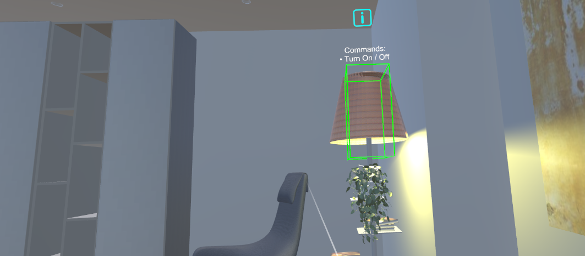
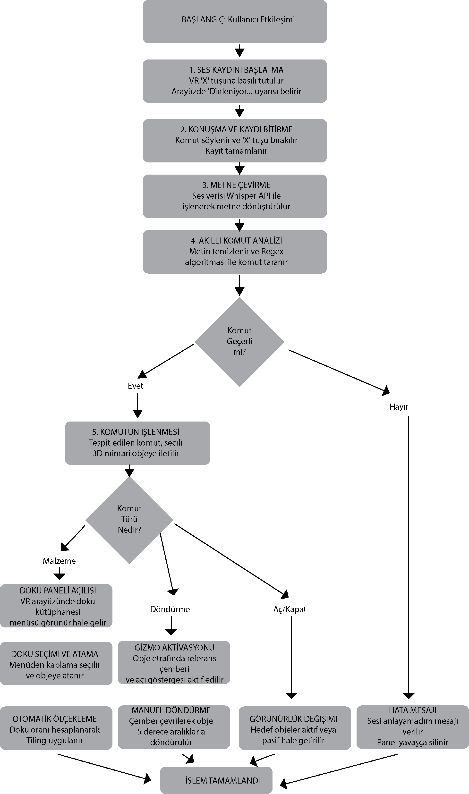

# STT-VR3DModeling (Speech-to-Text VR 3D Modeling)

STT-VR3DModeling; Sanal Gerçeklik (VR) ortamında çalışan, yapay zeka destekli bir ses-metin (Speech-to-Text) dönüşüm motoru kullanarak 3D objelerin karmaşık arayüzlere ihtiyaç duyulmadan manipüle edilmesini sağlayan bir bilgisayar programıdır. Geleneksel WIMP arayüzlerinin VR ortamındaki kısıtlamalarını ortadan kaldırarak kullanıcılara doğal bir etkileşim sunar. Sistem, kullanıcının sesli komutlarını Regex algoritmalarıyla analiz ederek sahnedeki etkileşimli objelere yönlendirir.

## Tescil ve Lisans Bilgileri
Bu yazılım, T.C. Kültür ve Turizm Bakanlığı Telif Hakları Genel Müdürlüğü tarafından **2026/19342** Kayıt-Tescil Numarası ile tescillenmiştir.
* **Eser Sahibi:** Hasan TAŞTAN
* **Tescil Tarihi:** 14.07.2026

---

## Sistem Mimarisi
Projenin mimari yapısı, düşük gecikme ve yüksek isabet oranı sağlamak amacıyla dört ana bileşenden oluşur:
1. **Nöral Ses İşleme Ünitesi:** Sesin alınması, Voice Activity Detection (VAD) ile filtrelenmesi ve Inference API (quantized model) ile metne dönüştürülmesi.
2. **IVR Etkileşim Ünitesi:** Ray-cast seçim mekanizması ve görsel geribildirimlerin yönetimi.
3. **3D Modelleme Motoru:** Geometrik manipülasyon (taşıma, döndürme, ölçeklendirme) ve "one-shot" durum yönetimi.
4. **HCI Geribildirim Döngüsü:** Gerçek zamanlı transkripsiyon gösterimi ile kullanıcıya durum şeffaflığı sağlanması.

---

## Temel Özellikler ve Mimari İşlevler
Geleneksel 3D modelleme ve render yazılımlarında materyal değiştirmek veya obje hizalamak, yüzlerce menü ve parametre arasında gezinmeyi gerektirir. STT-VR3DModeling, bu süreci doğal insan konuşmasıyla birleştirerek mimari konsept sunumları, iç mekan tasarımları ve proje planlamaları için önemli bir hız sunar.

### Anlık Materyal Kararları (Material)
Bir iç mekan tasarımında, zemindeki kaplamayı anında değiştirmek için sadece "Material" komutunu vermek yeterlidir. Arayüzde açılan dinamik menüden seçilen yeni doku saniyeler içinde zemine uygulanır. Sistem, atanan dokunun çözünürlüğüne göre otomatik UV/Tiling ölçeklemesi yaparak mimari gerçekçiliği korur ve doku bozulmalarını önler.

### Objelerin Hassas Konumlandırılması (Rotate)
Mekandaki bir sandalyeyi veya mobilyayı kendi ekseninde çevirmek için objeye bakarak "Rotate" demek yeterlidir. Bu komutla hedefin etrafında aktif edilen referans iletkisi (Gizmo) sayesinde, sandalye XZ düzleminde 5'er derecelik hassas açılarla (snap) milimetrik olarak istenilen konuma yerleştirilebilir.

### Nesne Görünürlük Kontrolü (On/Off)
"On" veya "Off" komutları ile iç mekandaki aydınlatma elemanlarının durumu eş zamanlı olarak yönetilebilir. Bu özellik, tasarımcının ve müşterinin Sanal Gerçeklik gözlüğünü başından hiç çıkarmadan, mekandaki farklı ışık senaryolarını ve atmosfer alternatiflerini kesintisiz bir şekilde deneyimlemesini sağlar.

---

## Sistem Akış Şeması
Uygulama arka planında çalışan sistem döngüsü; kullanıcı etkileşimiyle ses kaydının başlatılması, yapay zeka entegrasyonu ile kaydın metne dönüştürülmesi ve akıllı Regex analizi ile komutun sahnedeki mimari objeye yönlendirilmesi prensibine dayanır. Tespit edilen komutun türüne göre sistem; doku paneli açılışı, rotasyon aktivasyonu veya görünürlük değişimi işlemlerini gerçekleştirerek süreci tamamlar.

---

## Akademik Referans
Sistemin kavramsal omurgası, metodolojisi ve VR ortamındaki insan-bilgisayar etkileşimi (HCI) analizleri şu makalede detaylandırılmıştır:
> Taştan, H. (2025). *Development and Preliminary Study of a Speech-Based Interface for IVR-Based 3D Modeling*. 10. Uluslararası Mühendislik Bilimleri ve Multidisipliner Yaklaşımlar Kongresi, İstanbul, Türkiye.